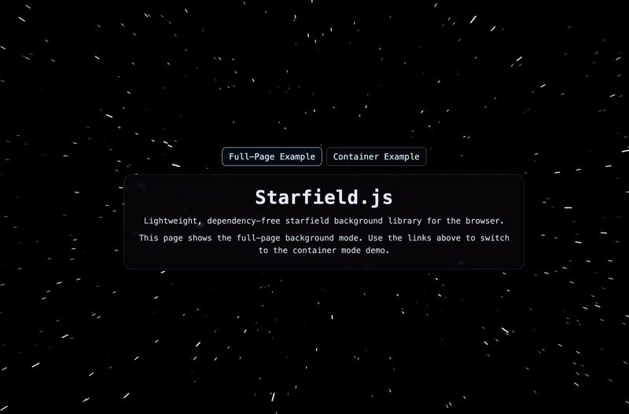

# Starfield.js

Lightweight, dependency-free starfield background effect for the browser.



Live Demos:
- Full-page example: [carlosrudriguez.github.io/starfield](https://carlosrudriguez.github.io/starfield/)
- Container example: [carlosrudriguez.github.io/starfield/container.html](https://carlosrudriguez.github.io/starfield/container.html)

Repository: [github.com/carlosrudriguez/starfield](https://github.com/carlosrudriguez/starfield)

`Starfield` gives you a warp-style animated star background using one JavaScript file and no frameworks.

## ✨ What This Library Does

- Renders a smooth starfield animation on a `<canvas>`
- Works as a full-page background
- Works as a background for a specific container (`div`, `section`, etc.)
- Uses time-based animation so speed feels consistent across different refresh rates
- Applies mobile/desktop tuning (speed and trail length)

## 👋 Who This README Is For

- If you are experienced, this is the project overview and API reference.
- If you are new to web development, follow the "Beginner Quick Start" sections step by step.

## 📁 Files Included In This Repo

- `index.html`: full-page background example
- `container.html`: container-only background example
- `starfield.js`: commented source file
- `starfield.min.js`: production/minified build

## 🚀 Beginner Quick Start (Option A: Download The File)

Use this if you want to copy the library into your own project folder.

1. Download `starfield.min.js` from this repo.
   - GitHub file page: [starfield.min.js](https://github.com/carlosrudriguez/starfield/blob/main/starfield.min.js)
   - Direct download URL: [raw.githubusercontent.com/carlosrudriguez/starfield/main/starfield.min.js](https://raw.githubusercontent.com/carlosrudriguez/starfield/main/starfield.min.js)
2. Put it in your website folder (for example next to your `index.html`).
3. Add this to your HTML file before `</body>`:

```html
<script src="./starfield.min.js"></script>
<script>
  const starfield = new Starfield({
    target: document.body,
    fullPage: true
  });
</script>
```

4. Open your HTML file in a browser.

If you see stars in the background, setup is complete.

## 🌐 Beginner Quick Start (Option B: Use jsDelivr CDN)

Use this if you do not want to copy the library file locally.

1. Add this to your HTML file before `</body>`:

```html
<script src="https://cdn.jsdelivr.net/gh/carlosrudriguez/starfield@v1.0.0/starfield.min.js"></script>
<script>
  const starfield = new Starfield({
    target: document.body,
    fullPage: true
  });
</script>
```

2. Open your page in a browser.

Notes:
- `@v1.0.0` is a pinned release and recommended for production.
- Use `@main` only if you always want the newest version immediately.

## 🧩 Minimal HTML Template (Copy/Paste)

If you want a full working page quickly:

```html
<!doctype html>
<html lang="en">
<head>
  <meta charset="utf-8">
  <meta name="viewport" content="width=device-width, initial-scale=1">
  <title>Starfield Example</title>
  <style>
    html, body {
      margin: 0;
      min-height: 100%;
      background: #000;
      color: #fff;
    }
    .content {
      position: relative;
      z-index: 1;
      min-height: 100vh;
      display: grid;
      place-items: center;
      font-family: monospace;
    }
  </style>
</head>
<body>
  <main class="content">Hello Starfield</main>

  <script src="./starfield.min.js"></script>
  <script>
    new Starfield({ target: document.body, fullPage: true, zIndex: 0 });
  </script>
</body>
</html>
```

## 🗂️ Container Mode Example

Use this when you want stars only inside a specific area:

```html
<div id="hero" style="height: 320px; position: relative;">
  <h2 style="position: relative; z-index: 1;">Hero Content</h2>
</div>

<script src="./starfield.min.js"></script>
<script>
  new Starfield({
    target: "#hero",
    fullPage: false,
    zIndex: 0
  });
</script>
```

## 🛠️ API

Create an instance:

```js
const sf = new Starfield(options);
```

Methods:

- `sf.start()` Start animation if stopped
- `sf.stop()` Pause animation
- `sf.resize()` Recalculate dimensions and regenerate stars
- `sf.destroy()` Remove canvas and listeners completely

## ⚙️ Configuration Options

All options are optional.

| Option | Default | Description |
| :--- | :--- | :--- |
| `target` | `document.body` | Element or selector where canvas is mounted |
| `fullPage` | `true` | `true` = viewport background, `false` = only inside `target` |
| `autostart` | `true` | Start animation automatically |
| `zIndex` | `-1` | Canvas stacking order |
| `backgroundColor` | `#000000` | Background fill color each frame |
| `starColor` | `#FFFFFF` | Star/trail stroke color |
| `starCount` | `800` | Number of active stars |
| `speed` | `10` | Base movement speed |
| `trailLength` | `10` | Base trail length |
| `mobileSpeedMultiplier` | `0.5` | Mobile speed factor |
| `desktopSpeedMultiplier` | `1.1` | Desktop speed factor |
| `mobileTrailMultiplier` | `0.65` | Mobile trail factor |
| `desktopTrailMultiplier` | `1` | Desktop trail factor |
| `mobileBreakpoint` | `900` | Viewport threshold used by mobile detection |
| `dprCap` | `2` | Caps device pixel ratio for performance |

## 🌍 Browser Support

Tested for modern browsers with Canvas 2D support:

- Chrome (desktop/mobile)
- Safari (macOS/iOS)
- Firefox
- Edge

For best performance on low-end devices, reduce `starCount` and/or `dprCap`.

## 🧯 Troubleshooting

If you do not see the effect:

1. Confirm script path is correct (`./starfield.min.js` or jsDelivr URL).
2. Open browser dev tools and check for JavaScript errors.
3. If canvas is hidden behind page background, set `zIndex: 0` and give your content `position: relative; z-index: 1;`.
4. If using container mode, ensure container has a non-zero width/height.

## 📣 Publishing Notes

- This repo can be served via GitHub Pages for live demos.
- jsDelivr can serve directly from this GitHub repo with no extra setup.

## 📜 License

This project is licensed under the **GNU General Public License v3.0 (GPL-3.0)**.

See the `LICENSE` file for the full text.
